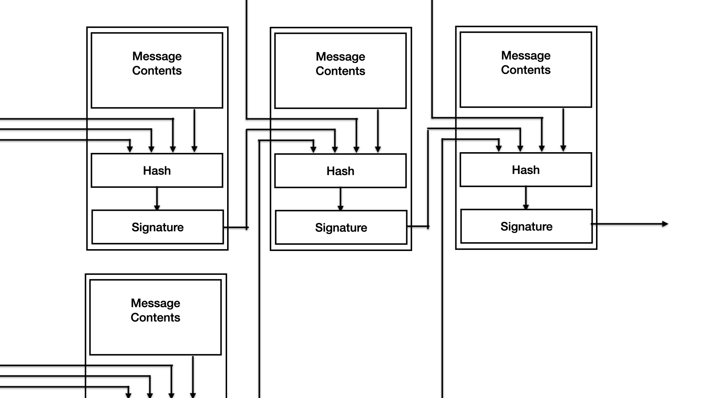
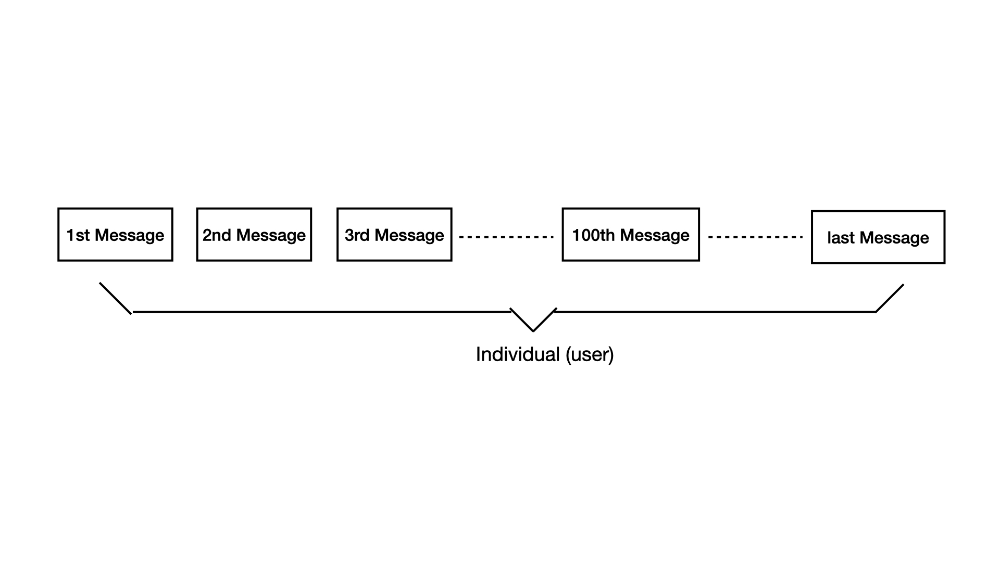

# PDU 去中心化的SNS (version 2)
A decentralized identity-based social networking service

* email: hello@pdu.pub
* wechat: pengpengt00
* twitter: [@PDUPUB](https://twitter.com/pdupub)

**摘要：** 我们认为一个最接近自然状态的社交网络应当具备两个基础功能，任何参与者都能够**自由的传播信息**，同时也能够**有效的获取信息**。

第三方平台的存在，为这两个目的提供了极大的帮助，通过手机号，邮箱等身份认证方式，有效的防止了大量创建虚拟身份和无限制的信息传播；利用推荐算法及用户之间的关联，提高了使用者获取目标信息的效率。但同时，第三方平台本身对于信息传播的影响也越来越严重，限制用户权限，屏蔽言论，利用推荐机制扩大特定话题的传播范围。我们并不否定舆论的引导在某特定事件上存在的积极意义，只想表达对于**信息非自然传播**的担忧。

本文提出一种新的解决方案，基于点对点的方式构建社交网络服务。网络中的每一条信息均由签名确定其来源，称为消息。通过消息之间的引用，同源消息可以构成全序关系，异源消息构成偏序关系。以消息为基础，使用者可以自由的创建社区规则，并基于自我认同，邀请他人参与自己所在的社区。社区内的用户均存在偏序的关联，使用者可以基于这种关联关系，以身份为标志对信息，及其关联身份的信息进行筛选。

<!-- MarkdownTOC depth=4 autolink=true bracket=round list_bullets="-*+" -->
- [简介](#简介)
  * [现状](#现状)
  * [目标](#目标)
- [消息](#消息)
- [个体](#账户)
- [社区](#社区)
  * [规则](#规则)
  * [内涵](#内涵)
- [网络传播](#网络传播)
- [奖惩激励](#奖惩激励)
- [隐私](#隐私)
- [计算](#计算)
- [总结](#总结)
- [FAQ](#faq)
<!-- /MarkdownTOC -->

## 简介

### 现状

在人类产生了**语言**之后，便开始了最原始的信息传播，即口耳相传。将看到的，听到的，感受到的信息，自愿选取后通过语言的形式传递给他人。如此往复，信息便能在人群中流转。**文字**的发明进一步拓展了信息传播的边界，无论在时间维度，还是空间维度。当今，随着**网络**的发展，信息传播的效率有了质的变化，基本摆脱了时间与距离的桎梏，只取决于自身的意愿。

但如同古代信件的传递依赖邮政系统，现今网络中信息的传播大多依赖于一个强大的第三方中心化服务，如Facebook、Twitter、微信、微博等社交网络服务。其存在毋庸置疑给使用者带来了极大的便利，但问题也逐渐显露。这个三方的中心化服务有能力按照自身的意愿，对信息的传播做出决定性的影响，比如有倾向性的增大或减小某个类别信息的传播受众，直接封禁或删除某些用户，同时对于另一些单一信息来源的用户无所作为等等。诸多问题最终可以归于一点，即第三方平台完全有能力影响信息的自然传播，其影响的程度，只能依赖于平台自身的行为准则。

信息传播中对于第三方服务的依赖和受其影响是必然共存的，如果希望信息的传播能够回归其本身的形态，更接近于自然传播，那必然需要抛弃对于第三方平台的依赖。也等同于需要解决在点对点的环境中，实现对于信息及用户的有效筛选。

### 目标

我们认为，一个自然的信息传播系统应具备两个基础功能：

1. 任何参与者都能够**自由的传播信息**。
2. 任何参与者都能够**有效的获取信息**。

本文参照现实中原始的自然的信息传播方式，提出一种新的解决方案，使得信息传播的过程能够摆脱对于第三方中心化服务的依赖。首先，系统中的每一条消息必须附加数字签名，以鉴别信息的来源。消息之间通过引用，可构建出全系统的一个或多个偏序关系。同时，来自同一私钥签名的消息通过引用构成全序关系。通过发布特定类型消息，任何使用者可以自由创建社区，指定创建规则。属于某个特定社区的使用者，均可通过特定类型的消息，以邀请的形式为自身所属的社区添加成员。人员所属的社区，社区中人员之间的邀请关系，将成为信息筛选的主要形式。

对于本文后续所述的信息传播系统，我们还提出两个前提设定：首先，系统中所有信息都是公开的。我们可以简单的理解为保密的信息不是本系统解决的目标，但可以基于本系统解决。第二，系统的参与者都以信息传播的程度为唯一利益衡量，且即包含时间尺度，也包含空间尺度。（两个设定的深入讨论可见附录中的相关文档，请见[草稿](Draft.md)）

## 消息

消息是系统中最基础的数据结构，也是点对点质检交互的唯一数据类型。系统使用过程中，涉及到的其他数据类型，如用户、社区等，均可由使用者以本地消息为基础自行构建。每条消息均包含3个组成部分，消息内容(Message contents)，引用列表(References)，签名(Signature)。

**消息内容**是消息的主题，有消息类型和多个内容片断构成。目前系统中包含5种消息类型。
* 一般信息消息(Info)是主要的消息类型，用于发布使用者希望通过此系统传播的信息。
* 个人资料设定(Profile)用于使用者设定自身属性，对于同一属性，后续设定更新属性。
* 社区属性定义(Community)用于设定新的社区规范，比如邀请限制等。
* 加入社区邀请(Invitation)用于发出对于其他使用者加入某特定社区的邀请。
* 结束生命周期(End)用于当使用者因某种原因(如私钥泄露)，希望系统能够忽略其后续消息时使用。

**引用列表**中可包含多条其他消息的签名，用以确定消息之间的有序关系。

后续的消息，可将任意已知的消息签名放入本消息体当中，再计算hash后签名。这样可以证明本消息必然发生于被引用的消息之后。在使用过程中，推荐在消息体中至少包含一条比较新的消息，目的是给本消息一个更精确的可信范围。

同一来源的消息，应确保通过引用的方式，使得所有消息间构成全序关系，即任意两条被同一私钥签名的消息，都有确定的先后顺序。不同来源的消息可借助相互的引用，构成一个或者多个偏序关系，可用有向无环图(DAG)表示。

**签名**的存在首先可以对消息来源进行身份认证，同时确定消息内容的完整性。消息签名还可以替代hash值，被放入后续消息的引用列表中，表示有序关系。

上图展示每个消息的构建及引用关系。

## 账户

系统中所有的消息均附带签名，用以对其来源进行身份验证，而这个身份即是账户。账户与私钥是一一对应的关系，但并不能视为包含或者等同。由于一个系统的使用者（自然人）可以创建多个账户，或者多个使用者操作同一账户的情况存在，所以账户与使用者之间也没有必然关系。我们认为，本系统中**账户**是一个以信息传播最大化为唯一目的的主体，由一系列具有全序关系的消息所展现，能够感知外部奖惩而修整未来行为的最小的单位。

在系统中，单独消息可以被看做是一个已经存在的孤立客观事件，其本身的内容不会因奖惩的影响而改变，也无法表现出对传播的渴望。我们将系统中由同一私钥所签名的所有消息及未来可能发布消息的预期进行有序合并，作为账户，即行为主体来实现自身的目的并接收外界的反馈。

对于从系统中获取信息的使用者而言，可以通过对于账户的区别对待，来表达对于信息发布账户的奖惩，使用者会更积极的获取和传播自己喜好的信息并关注其账户未来发布的消息。反之，也可以通过屏蔽账号等方式，减小此账户的传播。对于账号拥有者而言，由于信息接收者可以根据账户身份来屏蔽信息，所以生产大量无意义的信息虽然未被禁止，但却因无法被传播而失去了意义。

我们认为由于私钥创建的不受限及匿名等特性，账户的存在不会妨碍使用者信息发布的自由，即积极自由。同时账户的存在为信息筛选提供了标记，是支持系统使用者有效获取信息的基础，一定程度上保障了使用者的消极自由。

## 社区

### 规则

社区，作为账户之间关系的基本组织形态，是去中心化社交系统的必要部分。借助社区，系统使用者才能在没有信息发布限制的同时，通过个体筛选来获取有效的信息。前面我们以签名为标志在消息间建立联系，并将之视为个体，用来筛选消息。本节中的社区就是通过由邀请关系在用户间建立联系，并将构成的用户集合视为社区。需要说明的是，社区的存在主要目的就是帮助系统参与者对于可能感兴趣的账户进行筛选，并不直接作用于消息传播的过程。

社区的创建及使用过程应符合以下规则：

1. 每个账户都可以按照自身意愿定义任意多个社区规则，每一条发布的规则定义消息代表创建一个社区。
2. 规则包含社区内每个账户可以发出几次邀请，外部账户加入社区的最少邀请次数，社区内的初始账户，且创建者默认为社区内账户。
3. 加入社区，只能通过现有成员账户发出的邀请消息，并达到社区定规则的最低要求。
4. 社区的存在只是账户筛选的基础，系统使用者可以自主的屏蔽任何社区中的任何账户，以维护消极自由。

### 内涵

我们认为传统的第三方平台不仅是提供社交网络服务的技术平台，更重要的是提供了一个中心化的权威，由其定义规则标准，并依照这些标准对于用户进行评判。比如对于接受哪些用户的注册，平台往往会定义一些可验证的规则，比如手机号验证，邮件验证，或者KYC等。与此相似，在系统内部的组织结构中，也有设计类似的权威。在微信群中，会有管理员的身份；在reddit中会有版主。这类用户都具有超越其他用户的权限，使之能在权限范围内对其他用户进行惩罚，比如踢出群聊或者禁言等。我们认为，首先这种不平等不应当属于系统的最基础的账户间关系，其次我们认为基于自身对他人的认知而对他人进行处罚是不公正的。

与传统平台中的群组关系不同，在去中心化的系统中，社区并不存在任何单一的判定权威，社区内的账户是完全平等的，包含创建者在内，没有任何特殊。账户可以同时属于多个社区，每个社区中的账户都基于其自我角色认同，邀请新的账户加入。举例来说，我的账户可以同时加入了篮球运动社区和电影爱好者社区，当我通过浏览消息感觉某个账户非常喜欢篮球，我可能会对其发出加入篮球运动社区的邀请，但并不会邀请他加入电影爱好者社区。需要强调的是，当这个账户获得了足够的加入篮球运动社区邀请后就会被认为已经加入此社区，但这只表达了这个社区对此账号的认同，并不表示这个账号对于此社区的认同。还有要说明的是，社区是对于账户的界定，而非消息。

对于消息发布者而言，被邀请加入更多的社区表示自己被更大范围的承认，有利于自身的信息传播。对于信息获取者而言，社区的存在给予其更好的信息筛选基础，结合由邀请关系构成的社区内账户间关联，能够有效的屏蔽过滤冗余账户及其发布的信息。

## 网络传播

社交系统应具备两个基本功能即**自由的发布信息**和**有效的获取信息**。在传统的中心化服务中，消息的发布及获取都是以用户身份为基本单元，但是在去中心化的社交系统中却略有不同。账户为每个消息为每条消息添加对应的签名，成为发布信息的基本单元。而节点被作为获取信息的基本单元，并通过相互的连接构成网络，实现信息的自然传播。

节点和账户不存在任何的绑定关系，信息的获取者无需任何账户均可以使用或构建节点。节点的作用在于可自由选择如何处理收到的信息，如接收（保存），拒绝（屏蔽）或者传播（转发）。每个节点可以保存任意部分消息而非全量。传播过程支持平台化节点的存在，他们可以存储更多的消息，并为使用者提供消息查询、搜索等服务，但区别于中心化的第三方平台，消息属于发布的账户。所以，使用者可以自由的使用任何一个第三方平台，而获取到相同的信息。当然，任何平台也有对特定消息按照自身意愿屏蔽的自由。

对于节点是否接收某个消息，取决于：
1. 消息签名者是否被屏蔽。
2. 消息引用所代表的时间，倾向于时间更近的。

对于节点是否转发某个消息，取决于：
1. 对消息内容，某种意义上类似于点赞和订阅等。
2. 自身的转发规则，倾向于未被广泛扩散的消息。

需要注意的是，消息的传播过程是一直在动态变化的，系统中的每个节点都可能在任何时刻传播，存储或删除任何消息。

## 奖惩激励

我们认为一个可持续运行的系统应该包含两个要素，即**必要的共识规则**和**合理的利益驱动**。所有参与者对于规则的认同，是构成系统的基础，或者说任何系统都是由认同某些同样规则的个体所组成。而合理的利益驱动则是系统参与者行为的原因，其不会改变，规则只有顺应参与者的利益驱动系统才能持续。通过定义**消息**、**个体**和**社区**的概念，我们已经为构建去中心化的信息传播系统提供了足够的规则。本节中我们进一步解释，为何基于这些规则，系统能够符合参与者的利益驱动，使得系统持续的运行。

在前面的章节中我们提出过一个前提设定，即系统的参与者都以信息传播的程度为唯一的利益衡量，所有在本节的讨论中，我们也会以这个前提设定为基础，来解释用户行为对于互相之间的影响。我们认为一个系统的参与者对于其他参与者的奖励等同于帮助其消息的扩散，反之，惩罚则表现为自身对其消息屏蔽。而作为系统整体而言，对于每个账户信息的奖惩最终会表现为消息传播的速度与广度。奖惩的行为对于所有使用者来说都是平等的。奖惩完全取决于每个用户对其他用户的主观意愿。

需要特意指出，系统中还会出现一种可能被忽视的恶意行为，即通过引用关系，存在无法判断先后顺序的同源的消息。相当于由这个账户添加签名的已知消息可构成偏序关系但却无法构成全序关系。我们之所以将这种情况视为恶意行为，因为这种情况会使得系统失去将由此账号签发的系列消息视为单独个体的理论基础。

对于这种情况，我们建议的处理方式如下：

1. 一旦发现出现这种情况，应屏蔽此账户，不再接收其后续消息。
2. 对于已接收的消息，尽量以先被本系统接收的不矛盾消息为准，但也可主观选择。
3. 在发布消息时，应尽量引用多个可信的异源账户发布的消息，避免这种情况对自身的影响。
4. 将已接收的包含矛盾引用的消息视为包含未知引用的情况进行处理。

在下面[计算](#计算)章节中可以看到，在一个平均转发数为3次转发的系统中，一条被大多数人屏蔽的消息和另一个被极少人屏蔽的用户在信息传播方面的区别。我们也可以看到，社区作为用户筛选工具，其存在对于消息传播的影响。这种影响并不是直接的，强制性的，但却是巨大且具有决定性的。

总之，与传统的中心化社交系统不同，我们将信息的筛选判断的权利交给每个系统的参与者和他们之间的关联关系，每个系统参与者都可以有自己的选择，而非只能相信某一个中心化的平台，因为它提供了服务而不得不信。

## 隐私

如简介中所说，隐私不属于这个系统当中。

首先我们认为任何传播过的消息都会留下痕迹，而未留下痕迹的信息也等同不存在，因为其并未对系统产生影响。信息的传播的速度和广度取决于信息本身，所谓隐私只是公开程度限于某个暂时的，且无法保证的臆想。其后果往往不是信息的保密，而是扭曲后的继续扩散。

保护隐私的偏好来源于思维方式的局限，认为整体的利益破坏在于整体对于隐私的探查，但我们认为不公来源于并非所有的消息都**同等**程度的完全**公开**，现实中只有部分的个体的信息能够被另一部分个体所知，反之而不可能。真正的隐私只有个体心中从未表达过的信息，其不需要任何系统以任何形式进行保护。而公开的，有过传播的信息，都应该被准确的记录、公开。

对于通常意义上的隐私信息，我们认为其不直接属于这个系统。对于涉及隐私的文章，不推荐创建消息，即使是以加密的形式。因为在别人看来无意义的信息会影响账户其他信息的传播。对于涉及隐私的通讯，可以以消息的形式公布自己的联系地址，再通过其他方式进行联系。

## 计算

待完善……

具体计算几种不同的场景。

1. 正常的用户随着使用，其信息的扩散。

2. 非正常的用户，随着使用，其消息的扩散程度。

3. 过度传播（转发）对于用户本身的影响。

## 总结

我们利用数字签名及相互引用，将消息组合为代表某个特定意志的账户，并基于账户的自我认同，构建出社区这种具备关联关系的账户集合。通过这两个层级关系，彻底解决了在点对点的信息传播过程中，信息无法筛选的问题。使得系统使用者，在能自由创建消息的同时，也有能力在海量的数据中选取自己希望获取的部分。点对点的系统本身就保证了用户的积极自由，任何人可以依照自身意愿发布信息。同时，这个系统也给与了用户保护自身消极自由的权利，减少用所受冗余数据的影响。

与现今主流的保护用户隐私的想法不同，我们认为任何发生在不同个体间的信息交流，都会留下存在的痕迹。现今的问题根本上源于个体间信息披露的程度不同，当所有信息均被记录和公开时，谎言将会消失，活在当下将成为过去，我们将完成“时间”这个维度的升级。

## FAQ

1. 更多的相关内容

* [《草稿》](Draft.md) 未整理，主要是在Zen r0.2 到 r0.3之间的一些笔记，有时间顺序。
* [《PUD之禅》](Zen.md) 简单的几句核心想法。

2. PDU的实现

[go-pdu](https://github.com/pdupub/go-pdu)

